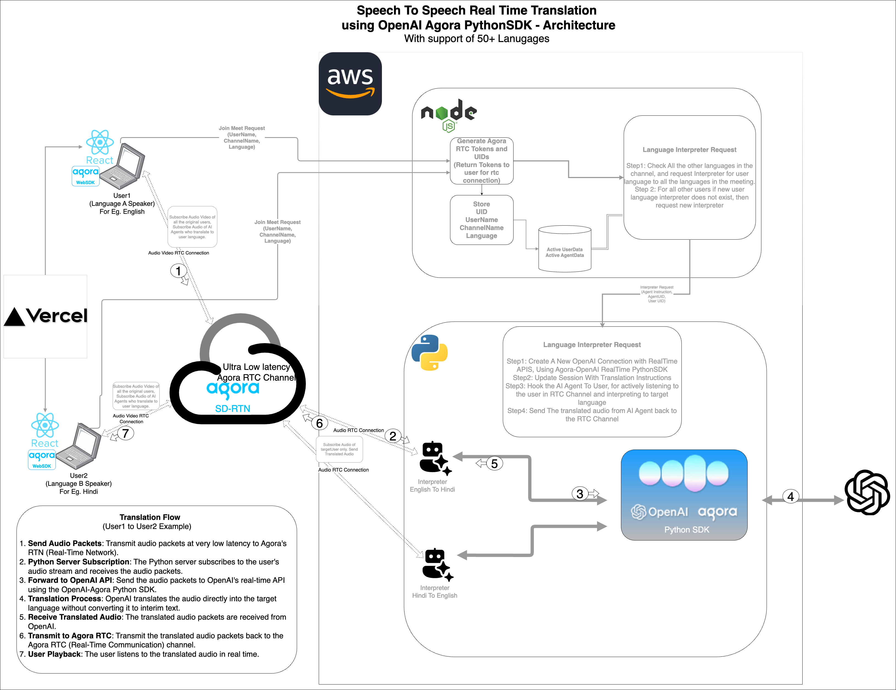

---

# **Real-Time Speech-to-Speech Translation Demo**  

This platform enables **real-time speech-to-speech translation** using **Agora** and **OpenAI**. Users can join meetings, select their preferred language, and communicate seamlessly while hearing translated audio in their chosen language—all with ultra-low latency. The system comprises three main components:  

1. **Frontend**: User interface for joining meetings and interacting with the platform.  
2. **Node.js Server**: Manages active users, channels, and generates Agora tokens.  
3. **Python Server**: Creates AI translation agents for real-time audio translation.  

---

## **Architecture Overview**  

1. **Agora RTC SDK**: Handles video and audio streaming between users.  
2. **OpenAI Realtime API**: Provides AI-powered translation for spoken language in real time.  
3. **Translation Agents**: AI agents listen to user audio, translate it, and stream the translated audio back to the meeting channel.  

---

## **System Flow**  

1. **User Joins Meeting**:  
   - Selects a preferred language for speech and transcription.  
   - Enters a username and channel name to join the meeting.  

2. **Agent Creation**:  
   - A Node.js server generates Agora tokens and requests the Python server to create AI translation agents.  
   - Each agent listens to a user and translates their speech into the selected target languages.  

3. **Real-Time Translation**:  
   - Audio streams are sent to the Agora RTC channel.  
   - AI agents listen to the streams and translate speech directly to the target languages.  
   - Translated audio is streamed back into the channel with ultra-low latency.  

---

## **Setup and Installation**  

### **Frontend**  

1. Clone the Frontend repository.  
2. Install dependencies:  
   ```bash
   npm install
   ```  
3. Start the development server:  
   ```bash
   npm run start
   ```  
4. Build for production:  
   ```bash
   npm run build
   ```  
5. To change the backend environment, edit the configuration file to point to a different environment (e.g., `localhost` for development).  

---

### **Node.js Server**  

1. Clone the Node.js repository.  
2. Create a `.env` file:  
   ```bash
   cp .env.example .env
   ```  
3. Add the following to `.env`:  
   ```plaintext
   AGORA_APP_ID=yourAgoraAppId  
   AGORA_CERT=yourAgoraCert  
   ```  
4. Install dependencies:  
   ```bash
   npm install
   ```  
5. Compile the TypeScript code:  
   ```bash
   npx tsc
   ```  
6. Start the server:  
   ```bash
   npm run start
   ```  
7. Configure HTTPS (production):  
   - Update `.pem` file paths in `src/app.ts`.  
   - Uncomment `HTTPS_SERVER.listen` for HTTPS support.  

---

### **Python Server**  

1. Clone the Python repository.  
2. Create a `.env` file:  
   ```bash
   cp .env.example .env
   ```  
3. Populate `.env` with:  
   - Agora App ID and Certificate ([Obtain from Agora](https://console.agora.io/en/))  
   - OpenAI API Key ([Obtain from OpenAI](https://platform.openai.com/api-keys))  

4. Set up a virtual environment:  
   ```bash
   python3 -m venv venv && source venv/bin/activate
   ```  
5. Install dependencies:  
   ```bash
   pip install -r requirements.txt
   ```  
6. Start the server:  
   ```bash
   python -m realtime_agent.main server
   ```  

---

## **Endpoints**  

### **Node.js Server**  

1. **`/getToken`**  
   - Generates an Agora token for the user to join a channel.  
   - Requests the Python server to create translation agents.  

2. **`/getUserName`**  
   - Returns the username associated with a UID.  

3. **`/user_left`**  
   - Cleans up resources when a user leaves the channel.  

### **Python Server**  

1. **`/start_agent`**  
   - Starts an AI agent with the specified parameters:  
     - `channel_name` (string): Agora channel name.  
     - `uid` (int): 8-digit UID of the agent.  
     - `target_user_id` (int): 4-digit UID of the user the agent listens to.  
     - `system_instruction` (string): Instructions for the agent.  

---

## **How It Works**  

1. **Joining a Meeting**:  
   - Users select a language and enter a channel.  
   - Agora handles audio/video streaming while translation agents handle translation.  

2. **Agent Interaction**:  
   - Each user is assigned AI agents for other users’ languages.  
   - Agents translate audio directly to the target language, bypassing intermediate steps, ensuring low latency.  

3. **Translation Logic**:  
   - If a new user joins, agents are created to translate between the new user’s language and existing ones.  
   - No agents are created for users speaking the same language.  

---

## **Related Repositories**  

1. **Frontend**: [Add Link]  
2. **Node.js Server**: [Add Link]  
3. **Python Server**: [Add Link]  
---
